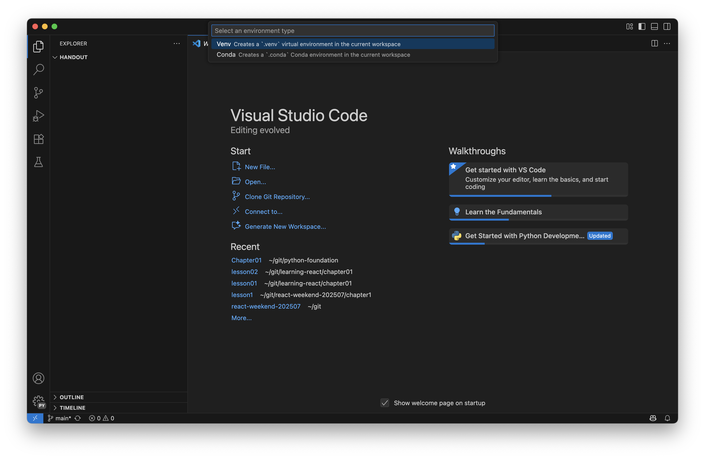

# Chapter 1 : Hello Python

This chapter introduces the Python development workflow. You will learn how to set up your environment, write and run Python programs, create tests with pytest, and debug code in VS Code.

## 🎯 Target of this chapter
By the end of this chapter, you will be able to:

- Set up a Python development environment
- Understand how Python works and executes code
- Create and organize a Python project in VS Code
- Write and run basic Python programs
- Write test cases using pytest
- Execute and manage test cases effectively
- Debug Python code within VS Code

## 🧭 Learning Path

In this chapter, you will take hands-on steps to set up Python and experience the real coding workflow:

- Check Requirements – Ensure your computer has everything needed for Python development
- Install Python and VS Code – Set up your coding environment
- Create a Virtual Environment – Keep your project isolated and clean
- Install Pytest – Get ready to test your code
- Write a Function Stub – Start with a simple function placeholder
- Write Your First Test Case – Define the expected result using pytest
- Run the Test Case (and See It Fail) – Understand how TDD works by failing first
- Implement the Function – Fix your code until the test passes
- Debug and Run Again – Learn how to catch errors and confirm success

### Check Requirements
Before you start coding in Python, make sure your system meets the minimum requirements:
- Operating System: Windows, macOS, or Linux
- Python Version: Python 3.10 or higher (latest stable recommended)
- Disk Space: At least 500 MB free for Python and project files
- Memory (RAM): Minimum 4 GB, recommended 8 GB for smoother performance
- Internet Connection: Required for downloading Python, VS Code, and packages
- Text Editor / IDE: We will use Visual Studio Code (VS Code) in this course

### Install Python and VS Code
- Download Python 

- Install Python to your machine

- Check Python Version
### Create Virtual Environment
Create a directory for python project. 
```
mkdir handout
cd handout

# Open Directory with VS Code
code .
```
There are several ways to create a Python virtual environment, but in this course, we will create one with VS Code support.


Short Cut to open Command Pallete:
|Operating System | Short Cut  |
|-----------------| -----------|
|Windows | Ctl + Shift + P |
|Mac | Cmd + Shift + P  |

Open Command Pallete and Run "Python : Create Environment" Command.


Select Venv for environment.


Select python version for project.


### Install Pytest
After creating virtual environment, we have to install pytest dependency. Open the terminal and run these commands.

```
# Install Pytest
pip install pytest
```

After installing pytest, run the following command in your project’s root directory:
```
pip freeze > requirements.txt
```
#### Explanation

- pip freeze lists all the Python packages currently installed in your virtual environment, along with their exact versions.
- \> redirects that list into a file named requirements.txt.
- This file is used to keep track of project dependencies so that others (or you in the future) can recreate the same environment by running:
```
pip install -r requirements.txt
```

#### Why we do this
We run this command to capture the exact versions of dependencies our project is using. This ensures:
- The project can be set up consistently on another machine.
- No unexpected issues arise due to version mismatches.
- It follows best practices for sharing Python projects.

#### Create source and test directories
```
# Create Source Directory
mkdir src

# Create Test Directory
mkdir tests
```

After creating the src and tests directories, add an empty __init__.py file in each directory to mark them as Python packages.


#### Test Configuration for VS Code
Open Command Pallete and Run "Python : Configure Tests" Command.


Select pytest as test framework.


Select test folder.


### Write a function stub
Create a file named hello.py inside the src directory. In hello.py, we will define our first Python function as follows:

```
def say_hello(name:str):
    return ""
```

This is just a stub function. We will add its implementation after writing the test case.

### Write your first test case
Create a file named test_hello.py inside the tests directory. In test_hello.py, we will define our first Python test case as follows:
```
from src.hello import say_hello

def test_say_hello():
    assert say_hello("Python") == "Hello Python"
```
This test checks whether the say_hello function returns the expected greeting when given the input "Python".


> Note: By convention, pytest automatically discovers and runs tests from files that start with test_ and functions that start with test_. That’s why we name the file test_hello.py and the function test_say_hello.

### Run the test case (and see it fail)
Run the following command in your project’s root directory to execute the tests:
```
pytest
```
At this point, the test will fail, because our function is only a stub and doesn’t contain the actual implementation yet.

Failing first is intentional — it confirms that the test is correctly written and will pass only when the function is properly implemented.

#### Test-Driven Development (TDD)
Test-Driven Development (TDD) is a software development approach where you:

1. Write a test first (it will fail because the functionality doesn’t exist yet).
2. Implement the code to make the test pass.
3. Refactor the code while keeping the test green (still passing).

### Implement the function
Now that we have a failing test, it’s time to implement the say_hello function so that the test passes.
Open hello.py inside the src directory and update the function:
```
def say_hello(name:str):
    return f"Hello {name}"
```

This implementation takes a name as input and returns a greeting.

### Debug and Run again
The test should now pass, confirming that our function works as expected.
```
pytest
```

You will see the result as follow.
```
(.venv) handout$ pytest
============================================ test session starts ============================================
platform darwin -- Python 3.13.6, pytest-8.4.1, pluggy-1.6.0
rootdir: /Users/minlwin/git/python-foundation/Chapter01/handout
collected 1 item                                                                                            

tests/test_hello.py .                                                                                 [100%]

============================================= 1 passed in 0.00s =============================================
```