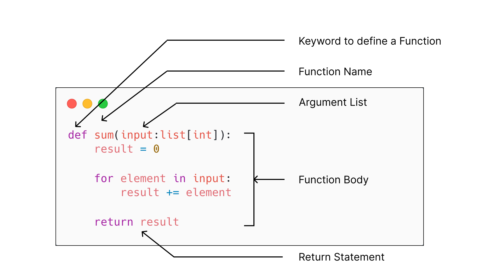

# Chapter 4 : Function

In this chapter, we explore functions in Python, one of the most important building blocks of programming. Functions allow us to group related code into reusable units, making programs easier to read, maintain, and extend.

By the end of this chapter, you will not only know how to define and use functions but also understand how they help you write cleaner, more efficient, and reusable code. We will also introduce functional programming concepts, which are widely used in modern software development.

## 🎯 Objectives

By the end of this chapter, students will be able to:

1. **Explain** what a function is in Python and why it is used.
2. **Identify** the structure of a function, including its definition, body, arguments, and return values.
3. **Write** Python functions to perform specific tasks.
4. **Use** arguments and return values effectively to make functions flexible and reusable.
5. **Apply** functional programming concepts such as pure functions, immutability, and higher-order functions.
6. **Organize** programs using functions for better readability, maintainability, and reusability.

This chapter builds on your knowledge of expressions and statements (Chapter 3) and takes you to the next step: structuring code with functions.

## ☕ What is Function

A function in Python is a block of reusable code designed to perform a specific task. Instead of writing the same code multiple times, you can group related statements together inside a function and call it whenever you need.

***Key Idea***

1. Reusable Code
    - Define once, use many times.
    - Saves effort and reduces errors.

2. Logical Grouping
    - Related statements are organized into one unit.
    - Makes the program easier to understand.

3. Problem-Solving
    - Large problems can be divided into smaller, manageable parts.
    - Each part can be solved by writing a function.

4. Readability and Maintainability
    - Functions make code cleaner, easier to read, and simpler to update.


***Why Functions Are Useful***   

✨ **Organize code into logical sections** – Each function handles one clear task.<br/>
♻️ **Avoid repetition** – Write code once and reuse it.<br/>
📦 **Break down problems** – Complex problems are solved step by step using smaller functions.<br/>
🔄 **Improve readability and maintainability** – Easier for others (and your future self) to understand and modify.

**Example**

```
# Without a function
print("Hello, Alice!")
print("Hello, Bob!")
print("Hello, Charlie!")

# With a function
def greet(name):
    print(f"Hello, {name}!")

greet("Alice")
greet("Bob")
greet("Charlie")
```

✅ The second version uses a function (greet) to remove repetition, organize logic, and make the program easier to extend.

## 📝 Wriging a Function

Every function in Python has a clear structure. Understanding this structure helps you write functions correctly and makes your code easier to read.

A function is made up of the following parts:

1. Function Definition
    - Starts with the keyword def.
    - Includes the function name (chosen by the programmer).

2. Parameters (Arguments)
    - Inputs that the function can accept.
    - Placed inside parentheses () after the function name.
    - Make the function flexible and reusable.

3. Function Body
    - The block of code that runs when the function is called.
    - Indented under the function definition.
    - Can contain any valid Python statements.

4. Return Statement
    - Sends a value back to the caller.
    - If not specified, Python functions return None by default.




### Arguments

Arguments are the inputs you pass into a function. They allow you to provide different values each time the function is called, making it flexible and reusable.

#### Type of Arguments in Python

1. **Positional Arguments** – Values are passed in the order they are defined.

    ```
    def greet(name, age):
        print(f"Hello, {name}, You are {age} years old.")

    greet("Alice", 25)                # name -> "Alice", age -> 25
    ```

2. **Named Parameters** - Pass values using parameter names.

    ```
    def greet(name, age):
        print(f"Hello, {name}, You are {age} years old.")

    greet(age=25, name="Alice")        # Order doesn't matter
    ```

3. **Default Arguments** – Provide a default value that is used if no argument is passed.

    ```
    def greet(name=, age=18):
        print(f"Hello, {name}, You are {age} years old.")

    greet("Alice")                     # Use default value 18
    greet("Bob", 25)                   # Overrides default
    ```

4. **Variable Arguments** – Use *args to accept multiple values as a tuple.

    ```
    def add_numbers(*numbers):
        return sum(numbers)

    print(add_numbers(1, 2, 3))   # Output: 6
    ```

5. **Keyword Arguments** – Use **kwargs to accept named arguments as a dictionary.

    ```
    def user_info(**kwargs):
        print(kwargs)

    user_info(name="Alice", age=25)
    # Output: {'name': 'Alice', 'age': 25}
    ```
📌 Arguments make functions customizable and reusable.

### Function Body

The function body is the block of code inside a function that performs the actual work.
- Always indented (by 4 spaces in Python).
- Can include any statements: calculations, loops, conditionals, even other function calls.
- Runs each time the function is called.

    **Example**

    ```
    def check_even(number):
        if number % 2 == 0:     # function body with conditional
            return "Even"
        else:
            return "Odd"
    ```

- The body checks if the number is even or odd.
- The function logic is separated neatly inside the body.

### Return Value

Functions can return a value using the return statement. This allows the function to send data back to the caller.
- If no return is written, the function returns None.
- A function can return any Python object: number, string, list, dictionary, or even another function.

- **Example 1: Returning a value**
    ```
    def square(x):
        return x * x

    result = square(5)
    print(result)   # Output: 25
    ```

- **Example 2: No return**
    ```
    def say_hello():
        print("Hello!")

    result = say_hello()   # Prints Hello!
    print(result)          # Output: None
    ```

📌 The return statement makes functions more powerful because their results can be stored, reused, or combined in further computations.

👉 With these three parts—Arguments, Function Body, and Return Value—you now understand the complete structure of a Python function.

## ⭐ Using Functions

**Why Do We Use Functions?**

- Functions are created for reusability.
- Once a function is defined, we can use it in different ways.
- There are two major ways to use a function:
    1. Calling a function to do a job
    2. Using a function in an expression to get a result

### 1. Calling a Function to Do a Job

Sometimes we want a function to perform an action, like printing a message or saving data. We call the function by writing its name followed by parentheses ().

Example
```
def greet(name):
    print("Hello", name)

# Calling the function
greet("Alice")
greet("Bob")
```

Output
```
Hello Alice
Hello Bob
```

✅ Here, greet("Alice") and greet("Bob") tell the function to do a job: print a greeting. This is useful when we just want the function to perform an action.

### 2. Using a Function in an Expression

Other times, we want a function to produce a value that we can use in further calculations. These functions use the return statement.

Example
```
def add(a, b):
    return a + b

# Using function in an expression
result = add(2, 3) * 5
print(result)
```

Output
```
25
```

✅ Here, the function add(2, 3) returns the value 5.
That value is then multiplied by 5, giving the result 25.
This shows how functions can be used inside expressions to calculate new results.

**Summary**

- Calling a function → tells it to do something.
- Using a function in an expression → tells it to return a result that can be used further.

Both are powerful ways to reuse code and make programs cleaner.

## 🏆 Benefits of Functions

🔁 **Reusability** - Write code once and use it many times

👀 **Readability** - Break big programs into small, clear parts

🛠️ **Easy Maintenance** - Fix problems in one place instead of many places

✅ **Testing & Debugging** - Test each function separately

👥 **Teamwork** - Different people can work on different functions

## 🔥 Assignments
After learning about this chapter, you have to try assignment.<br/>
[Got to Assignment](assignment/README.md)