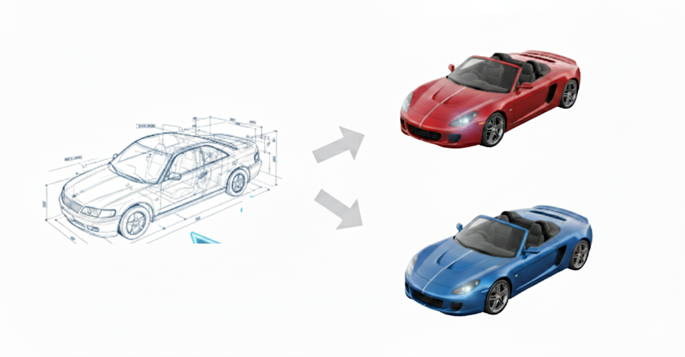
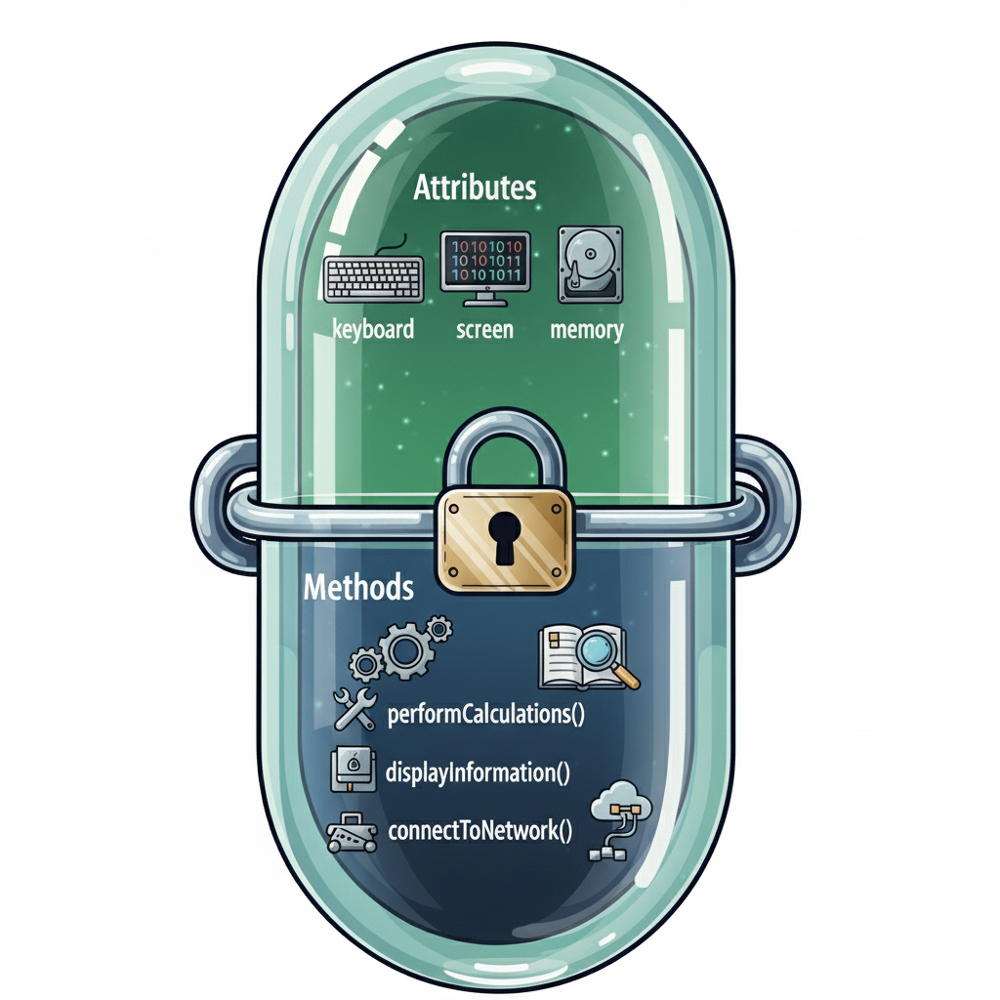
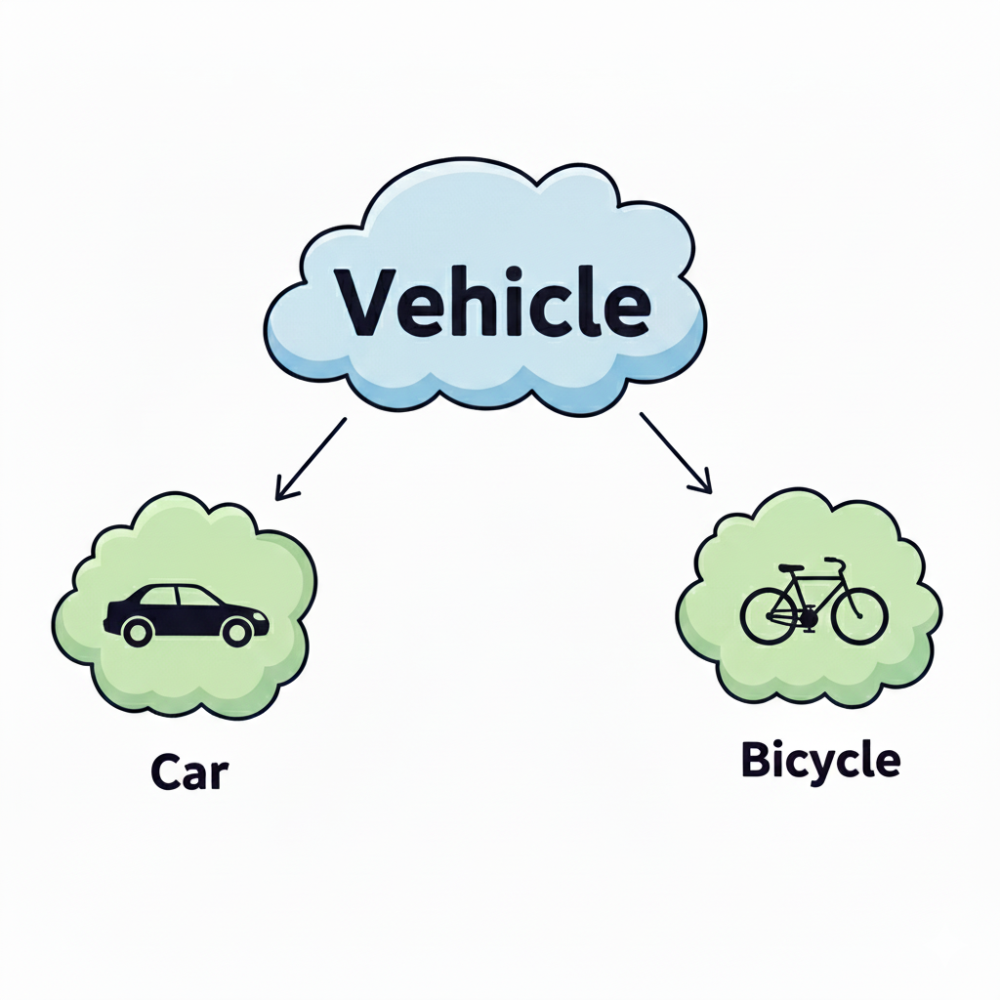
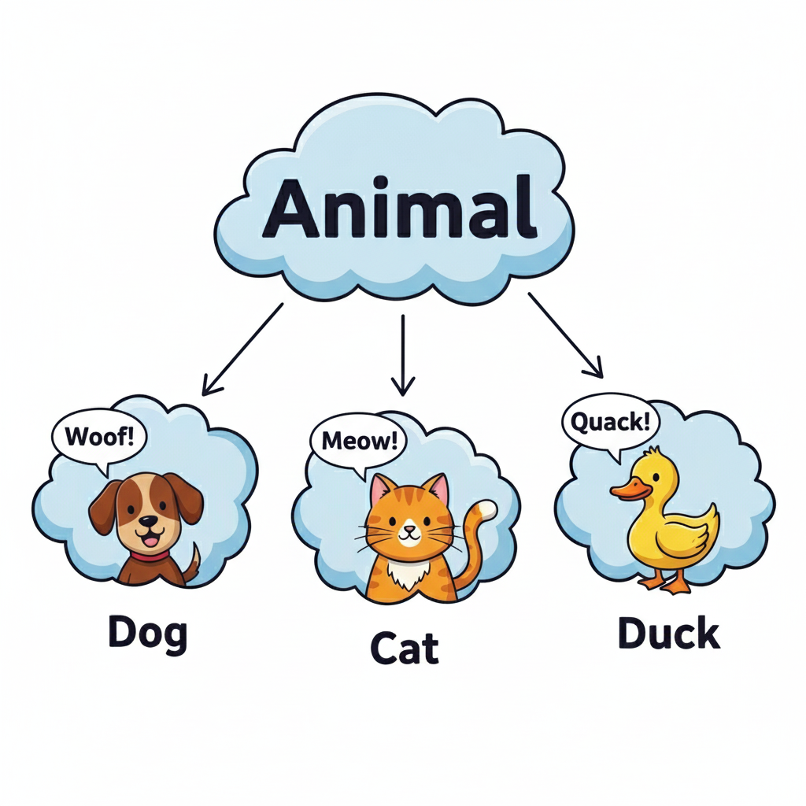
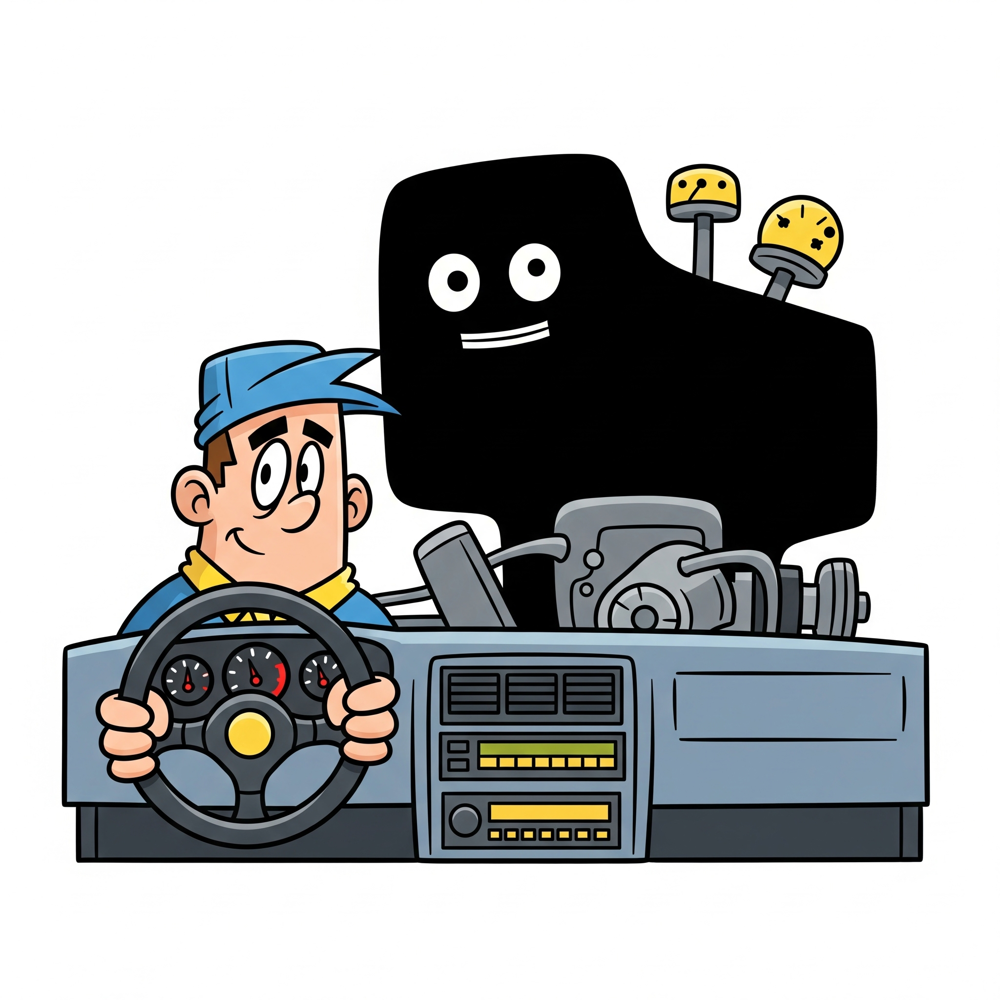

# Chapter 5 : Class & Object



A class is a blueprint or a template for creating something. It defines the general design and rules for a type of thing, but it's not the thing itself. Think of it like the master plan for a house that details the number of rooms, the layout, and the type of materials to use.

An object is a specific item created from that blueprint. It's a real-world instance of the class. Using our analogy, the object is the actual house built from the blueprint. You can have many different houses (objects) built from the same blueprint (class), each with its own unique characteristics like color or furniture, but they all follow the same basic plan.

**Why Do We Need Classes and Objects?**

- They help us organize code in a structured way.
- They allow us to model real-world problems in programming.
- They support reusability and scalability as programs grow larger.
- They are the foundation of Object-Oriented Programming (OOP), one of the most widely used paradigms.

**What You Will Learn in This Chapter**

1. How to define a class in Python.
2. How to create and use objects.
3. What we can define inside a class:
    - Attributes and Methods
    - Special methods like constructors (__init__).
4. The four basic OOP concepts:
    - Encapsulation, Inheritance, Polymorphism, Abstraction.
5. How to write simple programs that use classes and objects effectively.

💡 This chapter is the first step into Object-Oriented Programming. Once you understand classes and objects, you’ll be ready to build more complex and realistic programs.

## 🎯 Objectives

By the end of this chapter, students will be able to:

1. Explain what classes and objects are, and why they are important in Python.
2. Define a class and create objects (instances) from it.
3. Identify and use the components of a class:
	- Attributes (instance variables, class variables)
	- Methods (instance methods, class methods, static methods)
	- Special methods (__init__, __str__, etc.)
4. Apply the four basic OOP concepts in Python:
	- Encapsulation
	- Inheritance
	- Polymorphism
	- Abstraction
5. Write simple programs using classes and objects to model real-world problems.

## ✅ Writing Class and Creating Objects

### Writing a Class

In Python, we use the class keyword to define a class. A class is like a blueprint: it describes what data (attributes) and what actions (methods) the objects created from it will have.

**Syntax**
```
class ClassName:
    def __init__(self, parameters):
        # attributes (data)
        self.attribute = parameters

    def method_name(self):
        # behavior (action)
        pass
```

**🔑 Key Points :**

- class keyword → starts a class definition.
- __init__ → special method called constructor, runs automatically when creating objects.
- self → refers to the current object.
- Attributes = variables inside a class.
- Methods = functions inside a class.

### Constructor (__init__) method

A constructor is a special method that is called automatically when we create a new object. It is used to initialize the attributes of the object.

```
class Car:
    def __init__(self, brand, color):
        self.brand = brand
        self.color = color
```

When we create a new object, Python calls the constructor automatically:

```
car1 = Car("Toyota", "Red")
car2 = Car("Honda", "Blue")

print(car1.brand)   # Toyota
print(car2.color)   # Blue
```

✅ The constructor saved us from setting attributes manually every time.

### Creating Objects (instance)

An object is an instance of a class. We create an object by calling the class name like a function:

```
object_name = ClassName(arguments)
```

**Example**
```
class Car:
    def __init__(self, brand, color):
        self.brand = brand
        self.color = color

    def drive(self):
        print(f"{self.color} {self.brand} is driving")

# Create objects
car1 = Car("Toyota", "Red")
car2 = Car("Honda", "Blue")

# Call methods
car1.drive()
car2.drive()
```

**Output**
```
Red Toyota is driving
Blue Honda is driving
```

**🔑 Key Points :**

- Each object has its own data (brand, color).
- Objects can call methods defined in the class.
- Multiple objects can be created from the same class blueprint.

#### 🔆 Summary

- Class → Blueprint
- Object → Instance created from the class
- Constructor (__init__) → Initializes object attributes
- Attributes → Data stored in the object
- Methods → Actions the object can perform

## 💡 What can we declare in a Class

In Python, the purpose of writing a class is to create objects. A class can have attributes and methods. Attributes represent the state of the object, and methods define its behavior.

### Attributes

Attributes of a class are variables that hold data associated with the class or its instances (objects). They define the properties or characteristics of an object created from the class. Attributes can be broadly categorized into two types: instance attributes and class attributes.

#### 1. Instance Variable

Instance variables are unique pieces of information that belong to each specific object created from a class. Think of them as the personal characteristics of an object. 

They are defined within the __init__ method, which acts as the object's constructor. This means that every time you create a new object, it gets its own copy of these variables, which can hold different values from the variables in other objects of the same class.

```
class Car:
    def __init__(self, brand, color):
        self.brand = brand
        self.color = color
```

**🔑 Key Points :**
- Belong to each object
- Defined inside __init__

#### 2. Class Variable

Class variables are pieces of information that are shared by all objects created from a class. 

Unlike instance variables, they are defined inside the class but outside of any methods. This means that every object of that class can access and use the same variable. 

If you change a class variable, the change is reflected across all objects, which makes it a great way to store information that is common to all instances.

```
class Car:
    wheels = 4
```

**🔑 Key Points :**
- Shared by all objects
- Defined inside class, outside methods

#### 🔆 Summary

| Category | Instance Variables | Class Variables |
|----------|--------------------|-----------------|
|**Belong To** | Each individual objects  | Entire class (Shared by all object) |
|**Define In** | Inside __init__ using self | Inside class outside methods | 
|**Copy per Object** | Each object has it’s own copy | Only one copy for the whole class | 
|**Example** | self.brand, self.color | wheel = 4 |


### Methods

A method in Python is a function that belongs to a class. It's used to define the behaviors and actions that an object created from that class can perform. Methods are defined just like functions, but they may need to define first parameter according to their types.

#### 1. Instance Methods

An instance method is a function that belongs to an object. It's designed to work with the specific data of that object. The first argument of every instance method is a reference to the object itself, which is conventionally named self. 

This allows the method to access and modify the unique data stored in that particular object. In short, instance methods are the actions an object can perform on its own information.

```
def drive(self):
    print(f"{self.color} {self.brand} is driving")
```

**🔑 Key Points :**
- First argument is self
- Work with object data with self
- Use to work with object’s own data

#### 2. Class Methods

A **class method** is a function that belongs to the class itself, rather than to an individual object. You can identify it by the `@classmethod` decorator written just above its definition. 

The first argument of a class method is conventionally named `cls`, which is a reference to the class. This allows you to work with data from the class as a whole, rather than from a specific object. 

They are often used as "factory methods" to create new objects in a controlled or specialized way.

```
@classmethod
def vehicle_type(cls):
    return "Car"
```

**🔑 Key Points :**
- Mark with @classmethod decorator
- First argument is cls
- Work with data from class with cls
- Often use as factory method to create an object 

#### 3. Static Methods

A **static method** is a function that lives inside a class but doesn't need to work with the class's or an object's specific data. You can recognize it by the `@staticmethod` decorator above its definition. Unlike instance or class methods, it doesn't automatically receive `self` or `cls` as its first argument. 

It's essentially a regular function that you've logically grouped within a class to keep your code organized. You can think of it as a helper function that is related to the class but doesn't depend on any of its data.

```
@staticmethod
def honk():
    print("Beep! Beep!")
```

**🔑 Key Points :**
- Mark with @staticmethod decorator
- No self nor cls
- Independent utility method inside the class
- Group helper functions logically inside a class

#### 🔆 Summary

| Category | Instance Method | Class Method | Static Method | 
|----------|-----------------|--------------|---------------|
|Belong To | Individual Objects | Class (Shared by Objects) | Class (Independent) |
|First Parameter | self (object) | cls(class) | None |
|Access | Instance Variable | Class Variable | Nothing | 
|Call By | Object | Class or Object | Class or Object |
|Purpose / Usage | Work with object’s data | Work with class level data | Utility or Helper functions |

### Special Methods

In Python, every class is like a child of the object class. The object class is the parent that gives all classes some common tools, like special methods (__str__, __len__, etc.) and basic behavior. These inherited methods are called special methods, and they help your objects work with Python’s built-in features.

#### 1. Creation and Destruction

| Method | Description |
| :--- | :--- |
| `__new__` | The first method called during object creation; it creates and returns a new object. |
| `__init__` | The constructor that initializes the object's instance variables after it has been created. |
| `__del__` | The destructor; it is called when an object is about to be garbage collected. |


#### 2. Representation and String Conversion

| Method | Description |
| :--- | :--- |
| `__repr__` | Provides an "official" string representation, often used by developers for debugging. |
| `__str__` | Provides a user-friendly, "informal" string representation for an object, which is what is displayed by `print()`. |


#### 3. Comparison

| Method | Description |
| :--- | :--- |
| `__eq__` | Defines the behavior for the equality operator (`==`). |
| `__ne__` | Defines the behavior for the not-equal operator (`!=`). |
| `__lt__` | Defines the behavior for the less-than operator (`<`). |
| `__le__` | Defines the behavior for the less-than-or-equal-to operator (`<=`). |
| `__gt__` | Defines the behavior for the greater-than operator (`>`). |
| `__ge__` | Defines the behavior for the greater-than-or-equal-to operator (`>=`). |


#### 4. Container and Collection Emulation

| Method | Description |
| :--- | :--- |
| `__len__` | Defines the behavior for the `len()` function. |
| `__getitem__` | Defines the behavior for getting an item using bracket notation (e.g., `object[key]`). |
| `__setitem__` | Defines the behavior for setting an item using bracket notation (e.g., `object[key] = value`). |
| `__iter__` | Returns an iterator for the object, allowing it to be used in loops. |


#### 5. Other Useful Methods

| Method | Description |
| :--- | :--- |
| `__call__` | Makes an object callable like a function. |
| `__hash__` | Returns a hash value, allowing the object to be used as a dictionary key or in a set. |
| `__dir__` | Provides a list of attributes and methods on the object, used by the `dir()` function. |

## 🎉 Object Oriented Programming

Object-Oriented Programming (OOP) is a way of writing code that focuses on creating objects instead of just writing lists of instructions. Think of it as a way to organize your programs so they are easier to understand and manage, especially as they get bigger.

In OOP, you build your code around objects, which are like digital versions of real-world things. For example, you can create an Animal object, a Car object, or a User object. Each object has:

- Attributes: These are the data or characteristics of the object (like a car's color or a user's name).
- Methods: These are the behaviors or actions the object can perform (like a car's drive() method or a user's login() method).

### Why Is OOP a Big Deal?

OOP is important because it helps you:

- Organize Your Code: It breaks down large, complicated programs into smaller, more manageable pieces.
- Reuse Code: You can reuse objects and their features in different parts of your program, so you don't have to write the same code over and over.
- Model the Real World: It allows you to model real-world concepts in your code in a more natural way, which makes it easier to solve problems.

### Characteristics of OOP

Object-Oriented Programming is built on four fundamental concepts that work together to create well-organized and powerful programs. Think of them as the building blocks of an object-oriented system.

#### 1 Encapsulation



This is the practice of **bundling data and the methods that work on that data into a single unit** (the class). It's like putting all the controls and inner workings of a car engine into a sealed box. The driver (the user of the object) only needs to interact with a few key buttons and pedals (public methods) and doesn't need to see the complex machinery inside. This protects the data from being accidentally changed.


##### A Practical Analogy

Think of a car engine. 🚗 The engine has many complex parts (data) and a precise way of working (methods). As a driver, you don't need to know how the engine works to drive the car. You only need to interact with the steering wheel, pedals, and gear shift (public methods).

Encapsulation hides the complexity, so you don't accidentally break the engine by fiddling with its internal parts.

##### Encapsulation in Python

```
class BankAccount:
    def __init__(self, balance):
        self.__balance = balance  # private attribute

    def deposit(self, amount):
        self.__balance += amount

    def get_balance(self):
        return self.__balance
```

Users interact with the account only through methods, not directly accessing __balance.

##### 🔑 Key Points :

- **Data Hiding**: It protects an object's internal data from being directly accessed and changed from the outside.
- **Controlled Access**: You can only interact with the object's data through its public methods. This ensures the data is always handled correctly.
- **Modularity**: It makes your code more organized and easier to manage, because each class is a self-contained, independent unit.

#### 2 Inheritance



This allows a new class to **take on the characteristics of an existing class**. It's the "is-a" relationship in programming. For example, a `Car` **is a** `Vehicle`. By having the `Car` class inherit from the `Vehicle` class, it automatically gets all the common properties and behaviors of a vehicle, like `speed` and `stop()`. This saves you from writing the same code over and over again.

##### A Practical Analogy

Inheritance is a way for a class to **inherit** and **reuse** features from another class. This allows you to build a new class based on an existing one, without having to start from scratch.

Here's an analogy to help you understand:

* Imagine a general **Vehicle** class. This class holds common features that all vehicles share, like `speed` and `color`, as well as actions they can perform, like `start_engine()` and `stop_engine()`.
* Now, let's create a **Car** class. A `Car` is a type of `Vehicle`, so it can inherit all the basic features and actions from the `Vehicle` class. On top of that, the `Car` class can have its own unique features, like `num_wheels` set to 4, and a specific `drive()` action.
* Similarly, a **Bicycle** class could also inherit from `Vehicle`. It would get the same shared features but could have its own unique ones, like `num_wheels` set to 2 and a `pedal()` method.

##### Inheritance in Python

```
class Vehicle:
    def drive(self):
        print("Vehicle is driving")

class Car(Vehicle):  # Car inherits Vehicle
    def honk(self):
        print("Car is honking")
```

Car can use drive() from Vehicle without redefining it.

##### 🔑 Key Points :

- **Code Reusability**: You don't have to write the same code multiple times. If several classes share common features, define them once in a parent class.
- **Reduced Duplication (DRY Principle)**: Promotes "Don't Repeat Yourself" by sharing common code.
- **Logical Structure**: Helps organize classes into a hierarchical structure that reflects real-world relationships.
- **Extensibility**: Makes it easy to add new features or modify existing ones without altering the original code.

#### 3 Polymorphism



This means "many forms." It is the ability for different objects to **respond to the same method call in their own unique way**. Think of different animal objects like a `Dog` and a `Cat`. If you tell them both to `speak()`, the dog will `bark()` and the cat will `meow()`. Even though the command is the same, the result is tailored to the specific object.


##### A Practical Analogy

Imagine you have a remote control for your TV, your sound system, and your air conditioner. They are all different objects, but they all respond to the same action: pressing the "power" button.

* You press the **power button** on your **TV remote**. The TV turns on.
* You press the **power button** on your **sound system remote**. The sound system turns on.
* You press the **power button** on your **AC remote**. The AC turns on.

The `power()` method is the same across all of them, but each object handles the action differently. This is **polymorphism** in a nutshell: a single interface (`power()`) for multiple underlying actions. It allows you to use a single type of command to achieve varied results, making your interactions with different objects simple and consistent.

##### Polymorphism in Python

```
# Base class with a common method
class Device:
    def power(self):
        pass  # placeholder (to be overridden)


# Different objects implementing their own version of power()
class TV(Device):
    def power(self):
        print("TV turns on 📺")


class SoundSystem(Device):
    def power(self):
        print("Sound system starts playing 🎶")


class AirConditioner(Device):
    def power(self):
        print("Air conditioner starts cooling ❄️")


# Using polymorphism
devices = [TV(), SoundSystem(), AirConditioner()]

for device in devices:
    device.power()  # Same method call, different behaviors
```

##### 🔑 Key Points :

- **Makes code flexible**: same interface works for different objects.
- **Supports code reuse**: write one function, use it with many object types.
- **Improves readability**: consistent method names across classes.
- **Allows extensibility**: new object types can be added without changing existing code.
- **Closer to real-world modeling**: same action, different behaviors.

#### 4 Abstraction



This is about **hiding complex details and showing only the essential features**. It's the process of simplifying things. For example, when you use a smartphone app, you only see the buttons and a clean interface. You don't see the millions of lines of code or complex processes running in the background. Abstraction provides a simple, easy-to-use interface for a complex system.

##### A Practical Analogy

When driving a car, you are using **abstraction**. You interact with a simple interface—the steering wheel, pedals, and gear shifter—to control a highly complex machine. You don't need to understand how the engine works, how the transmission shifts gears, or the intricate electronics behind the dashboard.

This is the essence of abstraction: it gives you the **control without the complexity**. It hides all the difficult details and provides a straightforward way to use a system, allowing you to focus on the task at hand (driving) rather than the inner workings of the object (the car).

##### Abstraction in Python

```
from abc import ABC, abstractmethod

class Vehicle(ABC):
    @abstractmethod
    def start(self):
        pass

class Car(Vehicle):
    def start(self):
        print("Car engine starts 🚗")

class Bike(Vehicle):
    def start(self):
        print("Bike engine starts 🏍️")

# Using abstraction
vehicles = [Car(), Bike()]
for v in vehicles:
    v.start()
```

##### 🔑 Key Points :

- **Simplifies code**: users don’t need to know inner details
- **Defines a contract**: subclasses must implement abstract methods
- **Improves reusability**: common interface for many implementations
- **Hides complexity**: focus only on what’s necessary

### 🔆 Summary

- OOP organizes code around objects with attributes and methods.
- Four main principles:
    1. **Encapsulation** → Protect data inside objects
    2. **Inheritance** → Reuse code across classes
    3. **Polymorphism** → Same method behaves differently for different objects
    4. **Abstraction** → Hide complexity, show only necessary details
- Helps write modular, reusable, and maintainable programs.